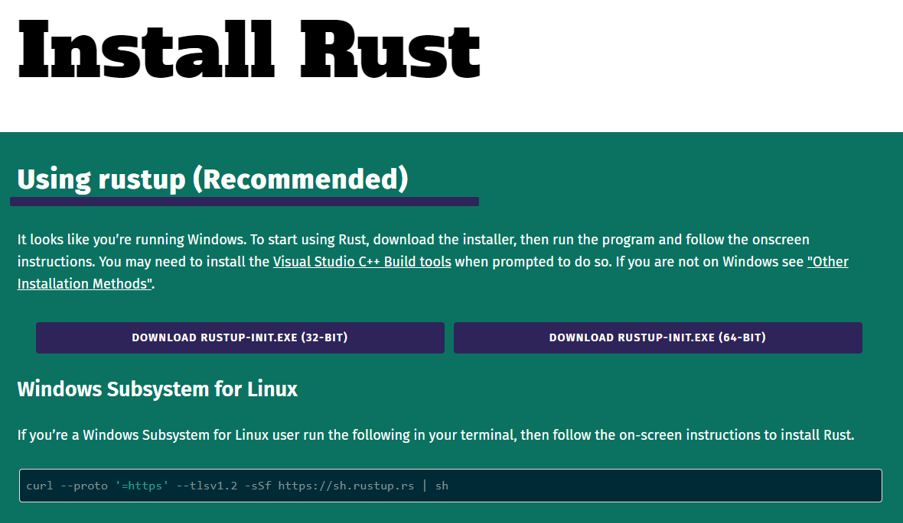

# Introducción a Rust

En esta sección aprenderemos:

- Como escribir y ejecutar nuestro primer programa en Rust.
- Como imprimir a pantalla texto y números.
- Como agregar comentarios.

Primero que nada para empezar a trabajar con RUST podemos hacerlo en Windows, Linux o Mac, 
para cada uno podemos realizar su respectiva instalación, vamos a la página de rust [https://www.rust-lang.org/tools/install](https://www.rust-lang.org/tools/install)



donde seguiremos las instrucciones según sea el caso.

Normalmente siempre hay que agregar al PATH del sistema la ubicación del binario de
Rust `~/.cargo/bin`.

Basta con abrir una linea de comando y ejecutar:

```bash
rustc --version
```
y deberemos ver algo como lo siguiente:

```bash
rustc 1.61.0 (fe5b13d68 2022-05-18)
```

Hay que notar que para cada sistema operativo tenemos tres versiones de Rust,
una versión estable, una beta y una llamada nightly. Como siempre se les recomienda
trabajar con la versión estable.


## Empezando a codificar en Rust

Cuando corremos un programa en Rust este busca la función main y entonces la ejecuta.
Por lo cual si no hay una función `main` decimos que este es un programa incompleto,
o se trata de una libreria la cual no sera llamada directamente.

Las librerias en Rust tienen  muchos puntos de entrada, pero un programa
en Rust solo uno, a traves de la principal `main`.

El mínimo código necesario para compilar un programq de Rust es: 

```rust
fn main(){}
```

para crear un nuevo proyecto usaremos el package manager `cargo` con la instrucción:
`cargo new <name_project>` que creará una carpeta con el nombre que designemos, por ejemplo `cargo new example_00`, 
que crea la siguiente estructura de archivos:

- example_00
  - src
    - [main.rs](./codes/example_00/src/main.rs)
  - [Cargo.toml](./codes/example_00/Cargo.toml)

por defecto el archivo contiene el código:
```rust
fn main() {
    println!("Hello, world!");
}
```

modifica el archivo para que solo contenga el siguiente código:

```rust
fn main(){}
```

el archivo `Cargo.toml` contiene información del paquete que acabamos de crear.

```rust
[package]
name = "example_00"
version = "0.1.0"
edition = "2021"

# See more keys and their definitions at https://doc.rust-lang.org/cargo/reference/manifest.html

[dependencies]
```


una vez creado vamos dentro de la carpeta `example_00` corremos la instrucción
`cargo run`.

con una salida como la siguiente:

```rust
D:\Rust-Notes\chapter_01\codes\example_00> cargo run
   Compiling example_00 v0.1.0 (D:\Rust-Notes\chapter_01\codes\example_00)
    Finished dev [unoptimized + debuginfo] target(s) in 0.36s
     Running `target\debug\example_00.exe`
```

es decir, una función `main`, sin parámetros con las llaves sin regresar nada.

Con ello tenemos el código más pequeño que podemos crear en Rust.

Hay que tenemos siempre nuestra funcion `main`, en caso de no contar con la función `main` tendriamos un error como el siguiente:

```rust
Rust-Notes\chapter_01\codes\example_00> cargo run
   Compiling example_00 v0.1.0 (D:\Rust-Notes\chapter_01\codes\example_00)
error[E0601]: `main` function not found in crate `example_00`
 --> src\main.rs:2:2
  |
2 | }
  |  ^ consider adding a `main` function to `src\main.rs`    

For more information about this error, try `rustc --explain E0601`.
error: could not compile `example_00` due to previous error
```

corriendo `rustc --explain E0601`

```bash
No `main` function was found in a binary crate.

To fix this error, add a `main` function
```

## Hello World

Ahora hagamos el nuestro clásico ejemplo Hello World.

 Ejecutemos `cargo new example_01`


que crea la siguiente estructura de archivos:

- example_01
  - src
    - [main.rs](./codes/example_01/src/main.rs)
  - [Cargo.toml](./codes/example_01/Cargo.toml)

por defecto el archivo contiene el código:
```rust
fn main() {
    println!("Hello, world!");
}
```

vamos dentro de la carpeta `example_01` y ejecutemos `cargo run` entonces tendremos una salida como la siguiente:

```bash
Compiling example_01 v0.1.0 (D:\Rust-Notes\chapter_01\codes\example_01)
    Finished dev [unoptimized + debuginfo] target(s) in 1.56s
     Running `target\debug\example_01.exe`
Hello, world!
```

En realidad no necesitamos utilizar el manejador de paquetes `cargo`, basta con que creemos un archivo que contenga el código:
```rust
fn main() {
    println!("Hello, world!");
}
```

digamos archivo `codigo_fuente.rs` y ejecutamos `rustc codigo_fuente.rs` esto generara dos archivos un ejecutable .exe
y un arhivo .pdb, más adelante hablaremos de estos archivos.

Podemos ejecutar simplemente 
```bash
D:\Rust-Notes\chapter_01\codes\example_02> .\codigo_fuente.exe
Hello, world!
```


Cosas a destacar aqui es que `println` no es una función si no se trata de una macro, para indicar que una macro será utilizada se utiliza el simbolo de admiración `!`, como en el ejemplo, al igual que en C/C++, las macros son replazadas por su correspondiente código en tiempo de compilación.


### Literal String

En Rust llamaremos literal string, a las cadenas de caracteres que se definan o utilizen en el código fuente, mientras que no literal, significara todos esos string que son son definidos en tiempo de ejecución a traves de lectura de archivo o al interactura con los usuarios, o copiar texto de un literal string.

## Imprimiendo combinaciones de literal strings

Podemos escribir varias cadenas de caracteres en la misma sentencia, al estilo python, usando las llaves que delimitan donde será puesta cada una de las cadenas:

```rust
print!("{}, {}", "Hola", "Mundo!");
```
salida:
```bash
Hola, Mundo!
```

En este caso la macro `print` recibe tres parámetros, separados por comas, aunque los tres parámetros son literal strings. 

Una diferencia significativa contra C/C++ es que aqui, si importa tener la misma cantidad de llaves que de variables
que iran dentro de esas llaves de lo contrario nos marcará un error de compilación, algo que no sucedia en C/C++.

Podemos agregar saltos de linea, simplemente agregando `\n`.


```rust
print!("Linea 1\nLinea 2\nLinea 3");
```
salida:
```bash
Linea 1
Linea 2
Linea 3
```

## Imprimir números

Como es de imaginarse podemos hacerlos de tres maneras

```rust
println!("Número pi: 3.14159");
println!("Número pi: {}","3.14159");
println!("Número pi: {}",3.14159);
```
salida:
```bash
D:\Rust-Notes\chapter_01\codes\example_03> cargo run
   Compiling example_03 v0.1.0 (D:\Rust-Notes\chapter_01\codes\example_03)
    Finished dev [unoptimized + debuginfo] target(s) in 1.05s
     Running `target\debug\example_03.exe`
Número pi: 3.14159
Número pi: 3.14159
Número pi: 3.14159
```

La primera como un literal string, la segunda como combinación de literal strings, y la tercera como combinación de un literal string con un literal number.


El comportamiento de la combinación de literal string con literal number es un tanto especial, literal number es convertido durante tiempo de ejecución a un string como podemos ver en el siguiente ejemplo:

```rust
    println!("Número pi: 3.14159");
    println!("Número pi: {}","3.14159");
    println!("Número pi: {}",3.14159);
    println!("Número pi: {}","0003.14159");
    println!("Número pi: {}",0003.14159);
```

salida:
```bash
D:\Rust-Notes\chapter_01\codes\example_04> cargo run
   Compiling example_04 v0.1.0 (D:\Rust-Notes\chapter_01\codes\example_04)
    Finished dev [unoptimized + debuginfo] target(s) in 0.69s
     Running `target\debug\example_04.exe`
Número pi: 3.14159
Número pi: 3.14159
Número pi: 3.14159
Número pi: 0003.14159
Número pi: 3.14159
```

Donde podemos ver que para la combinación de literal strings 
`"Número pi: {}","0003.14159"`, su salida fue tan solo sustituir las llaves por el texto, muientras que en la combinación `"Número pi: {}",0003.14159`, los ceros al inicio del número fueron ignorados.


## Comentarios

La sintaxis para agregar comentarios al código es la misma
que utilizamos en C/C++:

```rust
// este es un comentario de una sola linea
```

```rust
/* Este es un comentario de 
  varias
  lineas 
  de 
  código
*/
```

Los siguientes dos ejemplos son dos diferencias en los comentarios que se hacen en rust que trabajan de forma diferente a como lo harian en C/C++.

```rust
/* Este es un comentario /*valido  para
  varias*/
  lineas 
  de 
  código,
  en C/C++ esto no es valido
*/
```

```rust
/* Este es un comentario /* invalido  para
  varias
  lineas 
  de 
  código,
  en C/C++ esto es valido
*/
```
