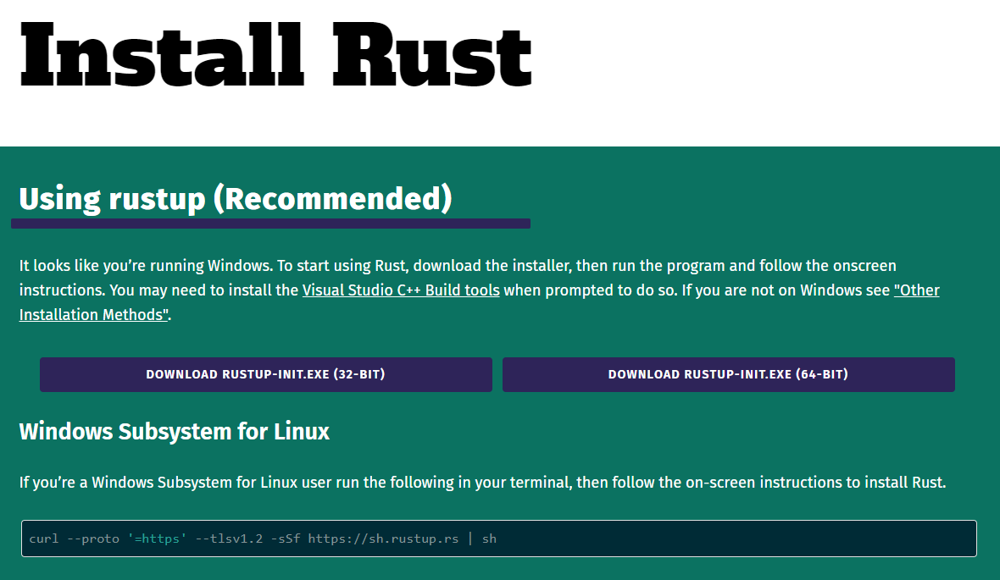

# Instalación y primeros pasos

Esta es la primera sección práctica de la **Semana 1**. Aquí aprenderemos:

- Cómo instalar Rust con `rustup` en Linux, macOS o Windows.
- Qué son `rustc`, `cargo` y los *toolchains* (`stable`, `beta`, `nightly`).
- Cómo crear, compilar y ejecutar un proyecto con **Cargo**.
- Cómo imprimir texto y números con las macros `print!` y `println!`.
- Cómo usar los *placeholders* de formato: posicionales, con nombre, `{:?}`, ancho y precisión.
- Cómo escribir comentarios, incluidos los comentarios de documentación.

> 💡 **Filosofía de la Semana 1:** *El compilador es tu pair programmer más estricto.*
> Desde el primer "Hola mundo" acostúmbrate a leer los mensajes de error completos:
> casi siempre dicen exactamente qué arreglar.

---

## Instalación

Rust funciona en Windows, Linux y macOS. La forma oficial de instalarlo es **`rustup`**,
el instalador y gestor de versiones de Rust. Las instrucciones para cada sistema están en
[rust-lang.org/tools/install](https://www.rust-lang.org/tools/install).



**Linux y macOS:**

```bash
curl --proto '=https' --tlsv1.2 -sSf https://sh.rustup.rs | sh
source "$HOME/.cargo/env"   # o abre una terminal nueva
```

**Windows:** descarga y ejecuta `rustup-init.exe` desde la misma página. Rust usa el
*linker* de Microsoft, así que el instalador te pedirá instalar las **Visual Studio Build
Tools** con el componente "Desarrollo para el escritorio con C++".

El instalador deja los binarios (`rustc`, `cargo`, `rustup`…) en `~/.cargo/bin`
(`%USERPROFILE%\.cargo\bin` en Windows) y agrega esa ruta al `PATH`.

### Verificar la instalación

```bash
rustc --version
cargo --version
```

Deberías ver algo como:

```text
rustc 1.96.0 (ac68faa20 2026-05-25)
cargo 1.96.0 (30a34c682 2026-05-25)
```

Tu versión será igual o más reciente: sale una versión estable de Rust **cada 6 semanas**.

### Toolchains: `stable`, `beta` y `nightly`

`rustup` gestiona tres canales:

| Canal | Qué es | Cuándo usarlo |
| :--- | :--- | :--- |
| `stable` | Versión estable, cada 6 semanas | **Siempre**, salvo que necesites algo experimental |
| `beta` | La próxima versión estable | Probar que tu código no se rompe con la siguiente versión |
| `nightly` | Compilación diaria con features experimentales | Features inestables (`#![feature(...)]`) |

Comandos útiles:

```bash
rustup update                  # actualiza todos los toolchains instalados
rustup show                    # muestra el toolchain activo
rustup component add clippy rustfmt rust-analyzer   # linter, formateador y LSP
rustup doc --book              # abre "The Rust Programming Language" sin conexión
```

---

## Tu primer proyecto con Cargo

`rustc` es el compilador, pero en el día a día usarás **Cargo**: el gestor de proyectos,
dependencias y compilación de Rust. Crea un proyecto nuevo con:

```bash
cargo new example_00
cd example_00
```

Cargo genera esta estructura (e inicializa un repositorio git):

```text
example_00/
├── .gitignore
├── Cargo.toml        ← manifiesto: nombre, versión, edición, dependencias
└── src/
    └── main.rs       ← punto de entrada del programa
```

El archivo [`Cargo.toml`](https://github.com/pepemxl/Rust-Notes/blob/master/src/chapter_01/example_00/Cargo.toml) describe el paquete:

```toml
[package]
name = "example_00"
version = "0.1.0"
edition = "2024"

[dependencies]
```

La clave `edition` indica qué **edición** del lenguaje usa el proyecto. Las ediciones
(2015, 2018, 2021, 2024) permiten introducir cambios incompatibles sin romper el código
existente: cada crate declara la suya y todas pueden convivir en un mismo programa.

Y [`src/main.rs`](https://github.com/pepemxl/Rust-Notes/blob/master/src/chapter_01/example_00/src/main.rs) contiene:

```rust
fn main() {
    println!("Hello, world!");
}
```

### La función `main`

Cuando ejecutamos un programa de Rust, lo primero que corre es la función `main`. Un
**binario** tiene exactamente un punto de entrada, `main`; una **librería** no tiene
`main` y expone muchos puntos de entrada (sus funciones públicas).

El programa más pequeño que compila en Rust es una función `main` sin parámetros que no
hace nada ([example_00](https://github.com/pepemxl/Rust-Notes/blob/master/src/chapter_01/example_00/src/main.rs)):

```rust
--8<-- "src/chapter_01/example_00/src/main.rs"
```

Reemplaza el contenido de `src/main.rs` por esa línea y ejecuta `cargo run`:

```text
~/proyectos/example_00$ cargo run
   Compiling example_00 v0.1.0 (~/proyectos/example_00)
    Finished `dev` profile [unoptimized + debuginfo] target(s) in 0.16s
     Running `target/debug/example_00`
```

Compila y corre, aunque no imprime nada. Si en cambio borramos también `main`, el
compilador se queja:

```text
~/proyectos/example_00$ cargo run
   Compiling example_00 v0.1.0 (~/proyectos/example_00)
error[E0601]: `main` function not found in crate `example_00`
 --> src/main.rs:1:2
  |
1 |
  | ^ consider adding a `main` function to `src/main.rs`

For more information about this error, try `rustc --explain E0601`.
error: could not compile `example_00` (bin "example_00") due to 1 previous error
```

Cada error tiene un código (`E0601`). `rustc --explain E0601` muestra una explicación
detallada con ejemplos:

```text
No `main` function was found in a binary crate.

To fix this error, add a `main` function:
```

> 💡 **Hábito:** cuando un error no te quede claro, ejecuta `rustc --explain <código>`
> antes de buscar en internet.

### Comandos esenciales de Cargo

| Comando | Qué hace |
| :--- | :--- |
| `cargo new <nombre>` | Crea un proyecto binario (`--lib` para una librería) |
| `cargo run` | Compila (si hace falta) y ejecuta |
| `cargo build` | Compila en modo *debug* → `target/debug/` |
| `cargo build --release` | Compila optimizado → `target/release/` |
| `cargo check` | Verifica que compila **sin generar binario** (mucho más rápido) |
| `cargo fmt` | Formatea el código con el estilo estándar |
| `cargo clippy` | Linter: detecta código poco idiomático y errores comunes |
| `cargo doc --open` | Genera y abre la documentación del proyecto y sus dependencias |

---

## Hello World

Crea un segundo proyecto con `cargo new example_01`. El código por defecto ya es el
clásico [Hello World](https://github.com/pepemxl/Rust-Notes/blob/master/src/chapter_01/example_01/src/main.rs); ejecútalo con `cargo run`:

```text
   Compiling example_01 v0.1.0 (~/proyectos/example_01)
    Finished `dev` profile [unoptimized + debuginfo] target(s) in 0.21s
     Running `target/debug/example_01`
Hello, world!
```

### Sin Cargo: `rustc` directamente

Cargo no es obligatorio. Basta con un archivo, por ejemplo
[`codigo_fuente.rs`](https://github.com/pepemxl/Rust-Notes/blob/master/src/chapter_01/example_02/codigo_fuente.rs), con el mismo código, y
compilarlo con `rustc`:

```bash
rustc codigo_fuente.rs
./codigo_fuente          # en Windows: .\codigo_fuente.exe
```

```text
Hello, world!
```

En Linux/macOS se genera el ejecutable `codigo_fuente`; en Windows, `codigo_fuente.exe`
más un archivo `.pdb` con símbolos de depuración. Para cualquier cosa más grande que un
archivo usa Cargo: gestiona dependencias, perfiles de compilación, tests y documentación.

---

## Macros de impresión

Observa el `!` en `println!`: **`println!` no es una función, es una macro**. Las macros
se expanden a código Rust en tiempo de compilación. Gracias a eso, el compilador
**verifica el formato**: si el número de `{}` no coincide con el de argumentos, el
programa no compila (en C, `printf` con argumentos de menos es comportamiento
indefinido).

| Macro | Salida | Salto de línea |
| :--- | :--- | :--- |
| `print!` | stdout | No |
| `println!` | stdout | Sí |
| `eprint!` / `eprintln!` | stderr (para errores y diagnósticos) | No / Sí |
| `format!` | Devuelve un `String` en vez de imprimir | — |

### Literales de cadena

Llamamos **literal string** a una cadena escrita directamente en el código fuente, entre
comillas dobles: `"Hola"`. Las cadenas que se construyen en tiempo de ejecución (leídas de
un archivo, escritas por el usuario, generadas con `format!`) son de tipo `String`;
veremos la diferencia entre `&str` y `String` en la
[Semana 2](section_04.md).

### Placeholders

Las llaves `{}` marcan dónde se inserta cada argumento:

```rust
fn main() {
    print!("{}, {}", "Hola", "Mundo!");
}
```

```text
Hola, Mundo!
```

Si sobran o faltan argumentos, el error aparece **al compilar**:

```rust
fn main() {
    println!("{} y {}", "Rust"); // ❌ NO COMPILA
}
```

```text
error: 2 positional arguments in format string, but there is 1 argument
 --> src/main.rs:2:15
  |
2 |     println!("{} y {}", "Rust");
  |               ^^   ^^   ------
```

Hay varias formas de referirse a los argumentos:

```rust
fn main() {
    // Posicionales: se pueden repetir y reordenar
    println!("{0} y {1}; {1} y {0}", "Rust", "Cargo");

    // Con nombre
    println!("{lenguaje} {version}", lenguaje = "Rust", version = 2024);

    // Variables capturadas directamente (Rust 1.58+): la forma más usada hoy
    let lenguaje = "Rust";
    let edicion = 2024;
    println!("{lenguaje} edición {edicion}");
}
```

```text
Rust y Cargo; Cargo y Rust
Rust 2024
Rust edición 2024
```

### Formato de depuración, ancho y precisión

Dentro de las llaves, después de `:`, se indica **cómo** formatear el valor:

```rust
fn main() {
    println!("{:?}", "texto");          // Debug: muestra las comillas
    println!("{:?}", (1, 2.5, 'x'));    // Debug funciona con tuplas, vectores, etc.
    println!("[{:>8}]", "der");         // alineado a la derecha en 8 columnas
    println!("[{:<8}]", "izq");         // a la izquierda
    println!("[{:^8}]", "centro");      // centrado
    println!("[{:08.3}]", 3.14159);     // 8 de ancho, relleno con ceros, 3 decimales
    println!("{:.2}", 2.0_f64 / 3.0);   // 2 decimales (redondea)
    println!("{:b} {:o} {:x} {:X} {:e}", 42, 42, 255, 255, 1234.5);
}
```

```text
"texto"
(1, 2.5, 'x')
[     der]
[izq     ]
[ centro ]
[0003.142]
0.67
101010 52 ff FF 1.2345e3
```

`{}` usa el trait **`Display`** (formato para usuarios) y `{:?}` usa **`Debug`** (formato
para programadores). Los tipos que definas tú no tienen `Display` automáticamente, pero sí
pueden derivar `Debug` con `#[derive(Debug)]`; lo veremos en la
[Semana 3](section_05.md).

### Secuencias de escape

```rust
fn main() {
    print!("Linea 1\nLinea 2\nLinea 3\n");
    println!("Tab:\tfin | Comillas: \" | Llaves: {{}} | Barra: \\");
}
```

```text
Linea 1
Linea 2
Linea 3
Tab:	fin | Comillas: " | Llaves: {} | Barra: \
```

Para imprimir una llave literal se duplica: `{{` y `}}`.

---

## Imprimir números

Un número se puede imprimir como parte del literal, como un literal string que pasa por
un placeholder, o como un **literal numérico** ([example_03](https://github.com/pepemxl/Rust-Notes/blob/master/src/chapter_01/example_03/src/main.rs)):

```rust
--8<-- "src/chapter_01/example_03/src/main.rs"
```

```text
Número pi: 3.14159
Número pi: 3.14159
Número pi: 3.14159
```

La salida es idéntica, pero no es lo mismo: en el tercer caso `3.14159` es un `f64` que se
convierte a texto en tiempo de ejecución. Se nota con ceros a la izquierda
([example_04](https://github.com/pepemxl/Rust-Notes/blob/master/src/chapter_01/example_04/src/main.rs)):

```rust
--8<-- "src/chapter_01/example_04/src/main.rs"
```

```text
Número pi: 0003.14159
Número pi: 3.14159
```

---

## Comentarios

La sintaxis básica es la misma que en C/C++:

```rust
// Comentario de una sola línea

/* Comentario
   de varias
   líneas */
```

Una diferencia: en Rust los comentarios de bloque **se pueden anidar**. Esto es válido en
Rust (y no en C/C++, donde el primer `*/` cierra el comentario):

```rust
/* Comentario externo
   /* comentario interno */
   el externo sigue abierto hasta aquí
*/
```

Y por la misma razón, esto **no** compila en Rust (pero sí en C/C++):

```rust
// ❌ NO COMPILA en Rust: el comentario anidado queda sin cerrar
/* Comentario externo
   /* comentario interno sin cerrar
*/
```

### Comentarios de documentación

Rust tiene comentarios especiales que generan documentación con `cargo doc`. Admiten
Markdown y, como veremos en el [Mes 2](../chapter_02/section_04.md), los ejemplos de
código que contienen se ejecutan como tests:

```rust
//! Documenta el módulo o crate que lo contiene (va al inicio del archivo).

/// Documenta el elemento que viene justo después.
/// Devuelve el doble de `n`.
fn doble(n: i32) -> i32 {
    n * 2
}

fn main() {
    println!("{}", doble(21));
}
```

---

## 🧪 Mini-reto: tarjeta de presentación

Crea un proyecto con `cargo new tarjeta` y escribe un programa que imprima exactamente
esto, usando variables capturadas (`{nombre}`), alineación y precisión en lugar de
escribir los espacios a mano:

```text
+----------------------------+
|        Ada Lovelace        |
+----------------------------+
| Lenguaje:             Rust |
| Edición:              2024 |
| Horas de estudio:     12.5 |
+----------------------------+
```

Pistas:

1. `{:^28}` centra un texto en 28 columnas.
2. `{:<18}` y `{:>8}` alinean a izquierda y derecha.
3. `{:.1}` fija un decimal para un `f64`.

Cuando funcione, ejecuta `cargo fmt` y `cargo clippy` y revisa si sugieren algo.

---

## ✅ Checklist

- [ ] Tengo Rust instalado y `rustc --version` / `cargo --version` responden.
- [ ] Sé qué es un toolchain y para qué sirven `stable`, `beta` y `nightly`.
- [ ] Creo proyectos con `cargo new` y conozco `run`, `build`, `check`, `fmt` y `clippy`.
- [ ] Sé qué es la **edición** en `Cargo.toml`.
- [ ] Entiendo que `println!` es una **macro** y que el formato se valida al compilar.
- [ ] Uso placeholders posicionales, con nombre y variables capturadas.
- [ ] Distingo `{}` (`Display`) de `{:?}` (`Debug`) y sé controlar ancho y precisión.
- [ ] Sé escribir comentarios normales, anidados y de documentación.

> **Siguiente paso:** [Aritmética en Rust](section_02.md).
