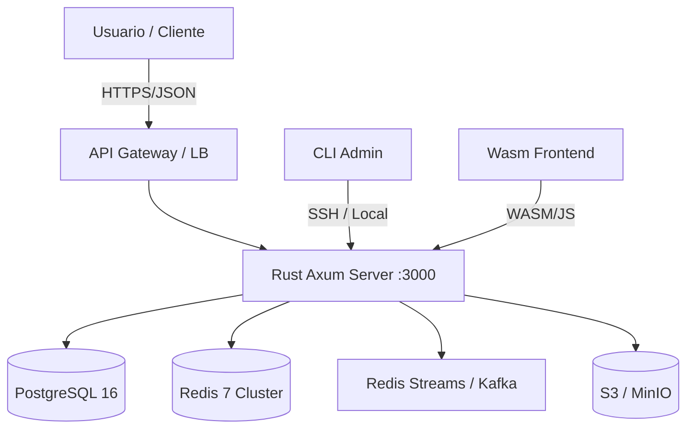
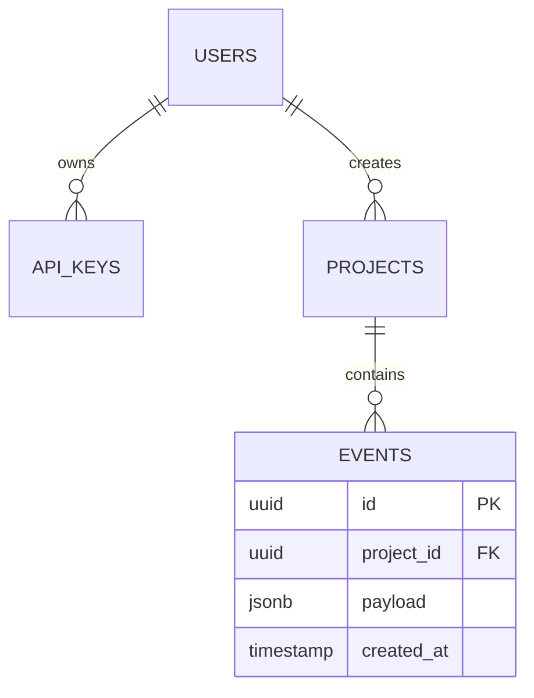

# 🦀 MES 6: PROYECTO FINAL CAPSTONE & ESPECIALIZACIÓN — "THE RUSTACEAN PORTFOLIO"
> **Filosofía del Mes:** *"Aquí no se aprende Rust, se demuestra que sabes ingeniería de software con Rust. El código es el currículum; la arquitectura, la tesis; la observabilidad, la garantía."*
> **Objetivo:** Entregar un **sistema distribuido completo, observable, seguro y documentado** que sirva como pieza central de tu portfolio técnico. Simular un entorno de producción real (CI/CD, Staging, Infra as Code, Postmortems).

---

## 🗓️ CRONOGRAMA MACRO (4 Semanas)

| Semana | Fase | Entregable Clave | Tiempo Estimado |
| :--- | :--- | :--- | :--- |
| **21** | **Fase 1: Diseño & Contrato** | `DESIGN.md`, `openapi.yaml`, `threat-model.md`, ADR (Architecture Decision Records) | 15-20h |
| **22-23** | **Fase 2: Implementación Core** | Workspace funcional (`core`, `server`, `cli`, `infra`), Tests E2E pasando, Deploy Staging | 40-50h |
| **24** | **Fase 3: Especialización & Pulido** | "Mastery Path" implementado, Docs completas, Video Demo 10min, Release `v1.0.0` | 20-30h |

---

## 📋 FASE 1: DISEÑO Y CONTRATO (Semana 21) — "Mide dos veces, corta una"

> **Regla de Oro:** **No se escribe una sola línea de código de implementación** hasta que `DESIGN.md` no tenga aprobado (auto-aprobado o por mentor/pares).

### 1. `DESIGN.md` — Estructura Obligatoria
```markdown
# Project: [Nombre] — Design Document v0.1

## 1. Problem Statement & Scope
- ¿Qué problema resuelve? (1 párrafo).
- ¿Qué **NO** resuelve? (Out of scope explícito).
- Usuarios objetivo / Actores.

## 2. Arquitectura de Alto Nivel (C4 Model - Contexto + Contenedores)

*Incluye diagrama Mermaid renderizado en GitHub/GitLab.*

## 3. Modelo de Datos (ER Diagram + SQLx Schema)

*Adjuntar `migrations/20240101_initial.sql` (vacío pero con tipos definidos).*

## 4. API Contract (OpenAPI 3.1 / `utoipa` / `aide`)
- **Fuente de verdad:** `docs/openapi.yaml` (generado desde código o escrito a mano primero - *Contract First*).
- **Endpoints Críticos:** Auth (`/auth/*`), Resources CRUD, Health (`/health`, `/ready`), Metrics (`/metrics`).
- **Versionado:** Header `Accept: application/vnd.myapi.v1+json`.
- **Errores:** RFC 9457 (Problem Details for HTTP APIs) — `type`, `title`, `status`, `detail`, `instance`.

## 5. Elección de Crates — Justificación Técnica (ADR Lite)
| Capa | Crate Elegido | Alternativas Descartadas | Justificación (Performance / Safety / Ecosystem / MSRV) |
| :--- | :--- | :--- | :--- |
| **Web Framework** | `axum` 0.7 | `actix-web`, `rocket`, `salvo` | Tower ecosystem, type-safe extractors, no macros magic, excelente performance. |
| **DB Driver** | `sqlx` 0.7 (native-tls) | `diesel`, `sea-orm`, `tokio-postgres` | Compile-time checked SQL, async native, zero-overhead, `query_as!` safety. |
| **Cache/Queue** | `redis` 0.27 (cluster mode) | `lapin` (RabbitMQ), `rdkafka` | Redis Streams para colas ligeras, sub-ms latency, clustering nativo. |
| **Auth** | `jsonwebtoken` + `jwks` | `oauth2`, `axum-login` | Control total sobre validación JWKS, rotación keys, scopes. |
| **Observabilidad** | `tracing` + `opentelemetry` + `metrics` | `slog`, `log` | Estándar industria, OpenTelemetry native, structured logging. |
| **Config** | `figment` | `config`, `confy` | Layered (File/Env/CLI), `serde` native, typed extraction. |
| **CLI** | `clap` 4.4 (derive) | `argh`, `structopt` (deprecated) | Industry standard, completions, man pages, env binding. |
| **Serialization** | `serde` + `serde_json` / `rmp-serde` | `bincode`, `postcard` | Interop JSON + MsgPack para internos. |
| **Testing** | `testcontainers` + `sqlx::test` + `proptest` | `mockall`, `wiremock` | Real DB en tests, property-based para logic. |

## 6. Threat Model (STRIDE Lite)
| Componente | Spoofing | Tampering | Repudiation | Info Disclosure | DoS | Elevation of Privilege | Mitigaciones |
| :--- | :--- | :--- | :--- | :--- | :--- | :--- | :--- |
| **API Public** | JWT Forge | Request Body Mod | Audit Logs | PII en logs | Rate Limit (Token Bucket) | RBAC Scopes | mTLS interno, JWKS Rotation, `tracing` redactado, `governor`/`tower-limit`, Policy Engine (Casbin). |
| **DB** | Cred Leak | SQLi | Immutable Audit Table | `SELECT *` leaks | Connection Pool Exhaust | `GRANT` minimal | `sqlx::query!` (parametrizado), `pgbouncer`, Roles `app_user` vs `migrator`. |
| **Redis** | - | Cache Poisoning | - | Session Hijack | Memory OOM | - | TLS, `maxmemory-policy allkeys-lru`, Keys namespaced. |

## 7. Decisiones Críticas (ADR - Architecture Decision Records)
*Crear `docs/adr/001-use-actor-model-for-counters.md`*
```markdown
# ADR 001: Actor Model for High-Throughput Counters
## Status: Accepted
## Context: Need to handle 100k+ increments/sec on URL redirects without DB contention.
## Decision: Use Tokio Actors (sharded) with bounded channels + periodic persistence batch.
## Consequences: Eventual consistency (ms) on counts. Complexity in shutdown (drain channels).
```

---

## ⚙️ FASE 2: IMPLEMENTACIÓN CORE (Semanas 22-23) — "Make it Work, Make it Right, Make it Fast"

### Estructura del Workspace (`Cargo.toml` Raíz)
```toml
[workspace]
resolver = "2"
members = [
    "crates/core",
    "crates/db",
    "crates/server",
    "crates/cli",
    "crates/wasm-frontend", # Opcional
    "xtask",
]
exclude = ["target", "**/target"]

[workspace.dependencies]
# Versiones centralizadas aquí (ver Mes 5)
axum = { version = "0.7", features = ["ws"] }
sqlx = { version = "0.7", features = ["runtime-tokio", "postgres", "chrono", "uuid", "json", "offline"] }
# ... resto de deps

[workspace.lints.rust]
unused_crate_dependencies = "warn"
# ... clippy denies from Mes 2/3

[profile.release]
lto = true
strip = "symbols"
codegen-units = 1
panic = "abort" # Tamaño + Seguridad
overflow-checks = true # = true # Opcional: detecta overflow en prod (costoso)
```

### 1. `crates/core` — Pure Business Logic (Zero I/O, Zero Async ideally)
*   **Regla:** `no_std` compatible (opcional pero recomendado para disciplina). Solo `core`, `alloc`, `serde`, `thiserror`, `derive_more`.
*   **Contenido:**
    *   Domain Models (`User`, `Project`, `Event` + **Typestates**).
    *   **Traits (Ports):** `UserRepo`, `EventStore`, `Cache`, `Clock`, `IdGenerator`, `EmailSender`.
    *   **Services (Use Cases):** `create_project`, `ingest_event`, `generate_report`. **Funciones puras** que toman `&impl Trait`.
    *   **Validation:** `validator` crate o custom `ValidationError`.
*   **Tests:** **100% Property-based (`proptest`)** para lógica de dominio. `cargo test --package core -- --test-threads=1` (determinista).

### 2. `crates/db` — Adapters (SQLx Implementation)
*   Implementa `core::traits::UserRepo` usando `sqlx::PgPool`.
*   **`sqlx::query_as!`** en **100%** de queries.
*   **Migraciones:** `sqlx migrate add ...` en `crates/db/migrations/`.
*   **Offline Mode:** `cargo sqlx prepare --workspace --check` en CI.
*   **Connection Pool:** `PgPoolOptions::new().max_connections(20).acquire_timeout(Duration::from_secs(5))`.

### 3. `crates/server` — Axum HTTP Layer
*   **State:** `AppState { core: CoreServices, db: PgPool, cache: RedisPool, config: Config }`.
*   **Extractors:** Custom `AuthUser` (extrae JWT, valida JWKS, devuelve `UserId`).
*   **Middleware Stack (Tower):**
    1.  `TraceLayer` (Request ID, Latencia, Status).
    2.  `CompressionLayer` (gzip/zstd).
    3.  `CorsLayer` (Configurable).
    4.  `RateLimitLayer` (Redis-backed `governor` o custom Lua script).
    5.  `AuthLayer` (Opcional por ruta).
    6.  `GracefulShutdownLayer` (Signal `SIGTERM` -> `drain`).
*   **OpenAPI:** `utoipa` derive en handlers -> `OpenApi` struct -> Servir Swagger UI en `/docs` (solo dev/staging).
*   **Graceful Shutdown:**
    ```rust
    // main.rs
    let server = axum::serve(listener, app).with_graceful_shutdown(shutdown_signal());
    tokio::select! {
        _ = server => {},
        _ = persistence_actor.handle_shutdown() => {}, // Flush buffers
    }
    ```

### 4. `crates/cli` — Admin Interface (Clap v4)
*   **Comandos:** `migrate`, `user create/delete/ban`, `stats`, `backup`, `restore`, `config check`.
*   **Reutiliza:** `crates::core` (logic), `crates::db` (migrations), `crates::server::config` (config loading).
*   **Output:** `--format json|table|csv` para scripting.

### 5. `infra/` — Infrastructure as Code
*   **`docker-compose.yml` (Dev):**
    ```yaml
    services:
      postgres: image: postgres:16-alpine; healthcheck: pg_isready
      redis: image: redis:7-alpine; command: redis-server --appendonly yes
      minio: image: minio/minio:latest; command: server /data
      mailpit: image: axllent/mailpit # SMTP testing
      app: build: context: .; dockerfile: Dockerfile.dev; depends_on: [postgres, redis]; env_file: .env
    ```
*   **`Dockerfile` (Prod - Multi-stage Cargo Chef + Distroless):**
    ```dockerfile
    # ... (Ver Mes 3/5) ...
    # Importante: COPY --from=builder /app/target/release/server /app/server
    # USER 65532:65532
    # ENTRYPOINT ["/app/server"]
    ```
*   **`.github/workflows/ci.yml`:** Matrix (stable, beta), `cargo hack`, `sqlx prepare --check`, `cargo audit`, `cargo deny`, Build & Push Multi-arch (amd64/arm64) a GHCR.
*   **`deploy/staging.yaml` (K8s / Docker Swarm / Fly.io / Railway):** Health checks, Resource limits, HPA (CPU/Memory/Custom Metrics).

---

## 🎯 FASE 3: ESPECIALIZACIÓN "MASTERY PATH" (Semana 24) — "Elige tu Arma"

> **Elige UNA ruta y ve profundo. No intentes todo.** Documenta *por qué* elegiste esa ruta para este proyecto.

### 🛤️ RUTA A: BACKEND / CLOUD NATIVE (Distributed Systems)
*   **gRPC + Tonic:** Define `proto` en `crates/proto`. Implementa `UserService` gRPC junto a REST. `tonic-build` en `build.rs`.
*   **Kubernetes Operator (kube-rs):** CRD `Project` / `ApiKey`. Controller en Rust (`kube::runtime::Controller`) que reconcilia estado (crea DB, configura Redis, DNS).
*   **Service Mesh / mTLS:** `linkerd2-proxy` sidecar o `cilium`. Configura `rustls` para mTLS interno automático.
*   **Distributed Tracing (OpenTelemetry):**
    ```rust
    // server/src/telemetry.rs
    use opentelemetry::{global, KeyValue};
    use opentelemetry_otlp::WithExportConfig;
    use tracing_opentelemetry::OpenTelemetryLayer;
    use tracing_subscriber::{layer::SubscriberExt, Registry};

    pub fn init_tracing() -> WorkerGuard {
        let tracer = opentelemetry_otlp::new_pipeline()
            .tracing()
            .with_exporter(opentelemetry_otlp::new_exporter().tonic().with_endpoint("http://jaeger:4317"))
            .install_batch(opentelemetry::runtime::Tokio)
            .unwrap();
        let otel_layer = OpenTelemetryLayer::new(tracer);
        // ... Registry::default().with(otel_layer).with(JsonLayer).init();
    }
    ```
*   **Entregable:** Dashboard Grafana (Golden Signals: Latency, Traffic, Errors, Saturation) + Alertas PrometheusRule.

### 🛤️ RUTA B: SYSTEMS / CLI EXTREMO (Developer Experience)
*   **Plugin System (`libloading`):**
    *   Define `trait Plugin { fn name(&self) -> &str; fn register(&self, registry: &mut PluginRegistry); }`.
    *   `PluginRegistry` guarda `Box<dyn Plugin>`.
    *   `cli` escanea `~/.mytool/plugins/*.so` (linux) / `.dylib` (mac) / `.dll` (win) al inicio.
    *   **ABI Stable:** Usar `abi_stable` crate o C-ABI manual (`extern "C" fn init_plugin() -> *mut dyn Plugin`).
*   **Self-Updater:** `self_update` crate. Verifica GitHub Releases, firma binario (`cosign`/`minisign`), descarga, verifica hash, reemplazo atómico (`rename`).
*   **Completion Generators:** `clap_complete` + generación dinámica de specs para plugins cargados.
*   **Entregable:** `cargo install mytool` -> `mytool plugin install github.com/user/cool-plugin` -> `mytool cool-plugin --help` funciona.

### 🛤️ RUTA C: WASM / FULLSTACK (Leptos / Dioxus / Yew + SSR)
*   **SSR + Hydration (Leptos/Dioxus):**
    *   `crate-server` sirve HTML inicial renderizado en Rust (`leptos::ssr::render_to_string`).
    *   `wasm-bindgen` + `wasm-pack` genera `.wasm` + JS glue.
    *   **Islands Architecture:** Solo componentes interactivos hidratan.
*   **Optimización Bundle:**
    *   `wasm-opt -Oz --enable-mutable-globals --strip-debug`.
    *   `twiggy` para analizar `top` functions / `dominators` (quién retiene código).
    *   `wee_alloc` / `lol_alloc` (si no `std`).
    *   Code Splitting: `wasm-split` (experimental) o dynamic `import()`.
*   **Frontend State:** `leptos::signal` / `dioxus::signal` + `server functions` (RPC type-safe).
*   **Entregable:** Lighthouse Score > 95 (Performance, Best Practices, SEO). TTFB < 200ms.

### 🛤️ RUTA D: DATA / ML (Polars + DataFusion + Candle)
*   **Analytics Engine:** `datafusion` para SQL sobre Parquet/CSV/Arrow en `crates/core`.
*   **ETL Pipeline:** `crates/cli` command `ingest` usa `polars` (Lazy API) para procesar TB de logs -> Parquet particionado (Apache Iceberg/Delta Lake via `delta-rs`).
*   **ML Inference:** `candle` (ONNX/Rust native) para embedding/clasificación en `server` (batch async via `tokio::task::spawn_blocking`).
*   **Vector Search:** `pgvector` (Postgres) o `qdrant` client para RAG.
*   **Entregable:** Benchmark `polars` vs `pandas`/`spark` en README. API `/embed` + `/search` funcional.

### 🛤️ RUTA E: EMBEDDED (Embassy + Defmt)
*   **Target:** RP2040 / ESP32-C3 / STM32H7 (QEMU si no hay HW).
*   **Architecture:** `embassy` tasks: `sensor`, `comm` (LoRa/WiFi/Ethernet), `display`, `storage` (LittleFS/Embassy-FS).
*   **Observabilidad:** `defmt` (logging zero-cost) + `probe-rs` / `probe-run` + `defmt-print` en host.
*   **Testing:** `embassy-nrf` / `embassy-stm32` mocks. `cargo test --target thumbv7em-none-eabihf`.
*   **Entregable:** Video demo hardware real + `defmt` logs fluyendo. `README` con esquemático KiCad/Fritzing.

---

## 📚 DOCUMENTACIÓN FINAL — "El estándar de una Crate Top 1%"

| Archivo | Contenido Mínimo Viable |
| :--- | :--- |
| **`README.md`** | Badges (CI, Version, License, Docs.rs, Coverage). One-liner. Quickstart (Docker Compose). Arquitectura ASCII. Links a Demo/Video. |
| **`ARCHITECTURE.md`** | Decisiones técnicas profundas (ADRs), Diagrama C4 completo, Data Flow, Threat Model, Trade-offs. |
| **`CONTRIBUTING.md`** | Setup dev (`just`/`make`), Code style (`rustfmt`/`clippy`), Commit Convention (Conventional Commits), PR Template, Release Process. |
| **`CHANGELOG.md`** | Keep a Changelog format. `Unreleased`, `v1.0.0` (fecha). Categorías: Added, Changed, Fixed, Security. |
| **`LICENSE`** | MIT / Apache-2.0 / AGPL-3.0 (elige consciente). `cargo deny check licenses`. |
| **`SECURITY.md`** | `security@email.com`, Supported Versions, Reporting Process, Disclosure Policy. |
| **`docs/`** | `openapi.yaml`, `adr/`, `api-guides/`, `deployment/`. Generado con `mdbook` o `gitbook`. |

---

## 🎬 LA ENTREGA FINAL: CHARLA TÉCNICA DE 10 MINUTOS
> **Simula una "System Design Interview" o "Tech Talk" interna.**

### Guion Sugerido (Diapositivas / Terminal en vivo)
1.  **Intro (30s):** Nombre, Problema, Stack, Rol.
2.  **Arquitectura (2min):** Diagrama C4. ¿Por qué Actor Model? ¿Por qué SQLx? ¿Por qué no Kubernetes (o sí)?
3.  **Deep Dive Técnico (4min) — *El "Meat"*:**
    *   *Muestra código real:* Typestate en `core`, Actor `ClickCounter` en `server`, `sqlx::query_as!` en `db`.
    *   *Explica un bug difícil:* "Race condition en contador -> Actor -> `loom` model checking".
    *   *Explica una optimización:* "Flamegraph mostró `SipHash` -> `ahash` + `CachePadded` -> 3x throughput".
    *   *Seguridad:* "JWT Validation con JWKS Rotation + `tower-limit` Lua script en Redis".
4.  **Observabilidad (1.5min):** Abre Grafana/Dashboards en vivo. Muestra Trace distribuido (Jaeger) de un request `POST -> DB -> Cache -> Response`.
5.  **Especialización (1min):** "Elegí Ruta X porque... [Demo rápido: Plugin cargando / gRPC call / Wasm SSR / Polars Query / Embedded Blink]".
6.  **Lecciones Aprendidas / Próximos Pasos (1min):** "Lo que haría distinto: `sqlx` offline mode desde día 1, `cargo-hack` en CI, `cargo-dist` para releases".

**Formato:** Graba con **OBS / Asciinema / ScreenToGif**. Sube a YouTube (Unlisted) / Loom / GitHub Repo `docs/demo.mp4`. Enlaza en `README.md`.

---

## ✅ CHECKLIST DEFINITIVO — "SHIP IT" (Definition of Done Global)

### Código & Arquitectura
- [ ] **Workspace:** `cargo test --workspace --all-features` **Pasa (0 warnings, 0 errors)**.
- [ ] **Core:** 0 `unsafe` (salvo FFI encapsulado). 0 I/O. 100% `proptest` coverage en lógica pura.
- [ ] **Server:** Axum + Tower middleware stack completo. Graceful Shutdown (drena actors, cierra pools).
- [ ] **DB:** `sqlx::query_as!` en todo. Migraciones idempotentes. `sqlx prepare --check` en CI.
- [ ] **Auth:** JWT + JWKS + Scopes (RBAC). Rate Limiting (Redis Lua). `tracing` structured JSON.
- [ ] **CLI:** `clap` derive, completions, man pages, `self-update` (si Ruta B), plugins (si Ruta B).
- [ ] **Tests:**
    - Unit: `core` (proptest), `db` (sqlx::test / testcontainers).
    - Integration: `tests/api_test.rs` (reqwest contra server real en Docker Compose).
    - E2E: `tests/e2e_test.rs` (CLI + Server + DB real).
    - Contract: `cargo test --doc` + `assert_cmd` para CLI.

### Observabilidad & Operabilidad
- [ ] **Logs:** JSON Structured (`tracing-subscriber::fmt::json`). `trace_id`/`span_id` correlacionados.
- [ ] **Metrics:** `/metrics` (Prometheus). **RED Metrics** (Rate, Errors, Duration) por endpoint. **USE Metrics** (Utilization, Saturation, Errors) para DB/Pool/Redis.
- [ ] **Tracing:** OpenTelemetry -> Jaeger/Tempo. Propagación `traceparent` headers.
- [ ] **Health:** `/health` (Liveness), `/ready` (Readiness: DB Ping, Redis Ping, Actor Mailbox Len < Threshold).
- [ ] **Alertas:** `PrometheusRule` (High Error Rate, High Latency P99, Disk Full, Replicas Down).

### DevOps & Supply Chain
- [ ] **CI:** `fmt` + `clippy -D` + `test` + `audit` + `deny` + `sqlx check` + `build` + `docker push` (GHCR) **en < 15 min** (Cache `cargo-chef` + `rust-cache`).
- [ ] **CD:** `main` -> Staging Auto. `tag v*` -> Prod Manual/Gate. `cargo-dist` / `cargo-release` para versionado/changelog/git tag.
- [ ] **Supply Chain:** `cargo deny check` (licenses, bans `yanked`, sources). `cargo audit` (CVEs). `SBOM` generado (`cyclonedx` / `spdx` via `cargo sbom`).
- [ ] **Docker:** Imagen Final **< 30MB** (Distroless/Scratch). Non-root. `SBOM` embebido (`/sbom.json`). `cosign` sign/verify en pipeline.

### Especialización (Ruta Elegida)
- [ ] **Ruta A:** gRPC `tonic` funcional + K8s Operator `kube-rs` reconciliando CRD + OTel Traces cross-service.
- [ ] **Ruta B:** Plugin System dinámico (`libloading` + `abi_stable`) + `self_update` verificado (cosign) + Completions dinámicas.
- [ ] **Ruta C:** Leptos/Dioxus SSR + Hydration + `wasm-opt -Oz` + `twiggy` analysis report + Lighthouse > 95.
- [ ] **Ruta D:** `polars` Lazy API ETL -> Parquet/Delta Lake + `candle` Inference API + `datafusion` SQL Query Engine expuesto.
- [ ] **Ruta E:** `embassy` async tasks en HW/QEMU + `defmt` logging + `probe-run` flash + `no_std` core logic compartido.

### Portfolio & Soft Skills
- [ ] **Repo Público:** `github.com/tu-usuario/tu-capstone`. `README` impecable.
- [ ] **Video Demo:** 10 min, audio claro, terminal legible (fuente grande), explica *decisiones*, no solo features.
- [ ] **Blog Post / `ARCHITECTURE.md`:** Escrito para un Senior Engineer. "Por qué X y no Y".
-"
- citando benchmarks propios (Mes 5).

---

## 🏁 CIERRE DEL CURSO: ¿Y AHORA QUÉ?

Has completado **6 meses de inmersión total en Rust**. Ya no eres "alguien que aprende Rust". Eres un **Ingeniero de Sistemas Rust**.

### Tu Toolkit Mental Ahora Incluye:
1.  **Ownership & Borrowing** como modelo mental por defecto (no solo sintaxis).
2.  **Async Rust** entendido como *State Machines + Executors*, no magia.
3.  **Traits & Generics** para abstracción de costo cero y testing puro.
4.  **Concurrencia Sin Miedos:** `Send`/`Sync`, `Mutex` vs `Actor` vs `Atomics` vs `Lock-Free`.
5.  **FFI / Wasm / Embedded:** Cruzar fronteras de lenguaje y hardware con seguridad.
6.  **Observabilidad Nativa:** `tracing` + `metrics` + `OpenTelemetry` como ciudadanos de primera clase.
7.  **Calidad Industrial:** `clippy`, `miri`, `loom`, `proptest`, `criterion`, `cargo-audit`, `cargo-deny`, `SBOM`.

### Próximos Pasos Reales:
1.  **Contribuye a Open Source:** Busca `good first issue` en `tokio`, `axum`, `sqlx`, `rust-analyzer`, `embassy`, `polars`, `candle`. Tu primer PR merged es tu certificado real.
2.  **Escribe un Crate Útil:** Pequeño, enfocado, bien documentado. Publícalo en `crates.io`.
3.  **Busca Trabajo / Proyectos:** "Rust Backend Engineer", "Systems Programmer", "Embedded Rust", "Wasm Engineer", "Blockchain/Infra Rust".
4.  **Mantente al Día:** `This Week in Rust` (Newsletter), `Rustconf` / `Rustlab` / `EuroRust` videos, `rust-lang.org/blog`.
5.  **Enseña:** Escribe un blog post, da una charla local, mentorea a alguien en el Mes 1. Enseñar es la mejor forma de consolidar.

---

### FELICIDADES YA TERMINARON

> **Habilidades Demostradas:**
> - ✅ Systems Programming & Memory Safety (Ownership, Borrowing, Lifetimes)
> - ✅ Async & Concurrency Mastery (Tokio, Actors, Atomics, Lock-Free)
> - ✅ Backend Engineering (Axum, SQLx, Postgres, Redis, Auth, Observability)
> - ✅ CLI & Developer Experience (Clap, TUI, Completions, Plugins, FFI)
> - ✅ WebAssembly & Frontend Integration (wasm-bindgen, Leptos/Yew, Optimization)
> - ✅ High-Performance Computing (Profiling, SIMD, Cache-Friendly, Allocators)
> - ✅ Software Architecture (Typestate, DI, Actor Model, Monorepo, ADRs)
> - ✅ Production Readiness (Docker, CI/CD, Kubernetes, Security, Supply Chain)
> - ✅ Specialization Depth (Cloud / Systems / Wasm / Data / Embedded)
