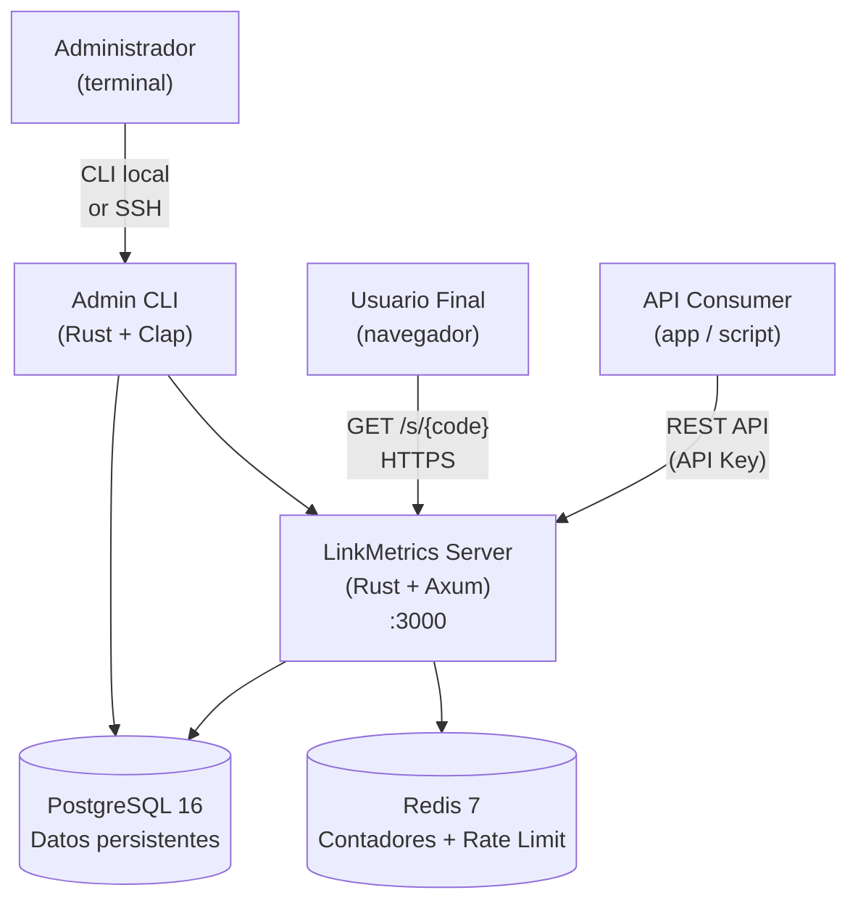
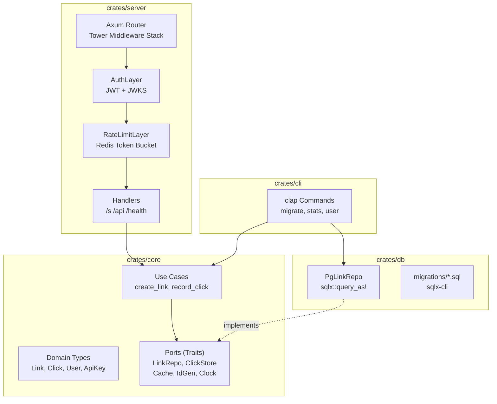
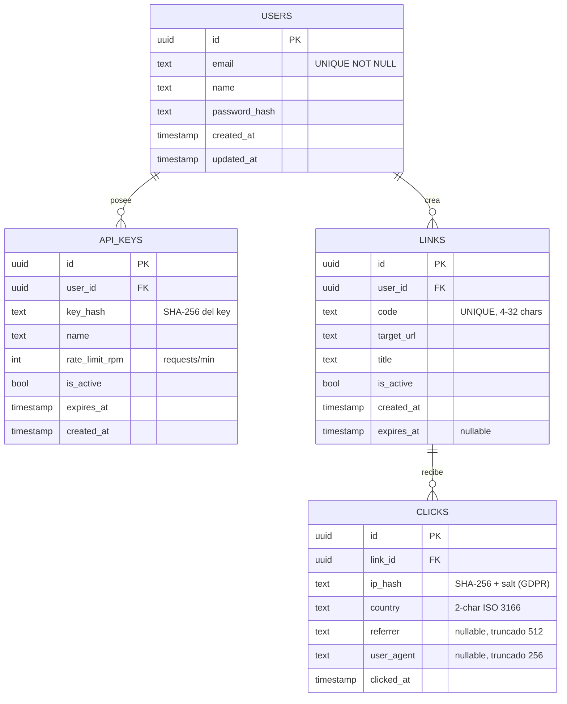

# Fase 1: Diseño y contrato — mide dos veces, corta una

La Semana 21 impone una regla absoluta: **no se escribe una sola línea de
código de implementación hasta que `DESIGN.md` esté completo**. Esta semana
produce documentos, no binarios.

En esta sección aprenderemos:

- Por qué el diseño previo es la inversión con mayor ROI en sistemas complejos.
- Cómo escribir un `DESIGN.md` profesional con el modelo C4.
- Cómo definir el contrato API en OpenAPI 3.1 antes de implementarlo
  (*contract-first*).
- Cómo aplicar STRIDE para identificar amenazas de seguridad al nivel de diseño.
- Cómo escribir ADRs (Architecture Decision Records) que justifican las
  decisiones técnicas para tu yo del futuro y para el equipo.
- Los patrones de código que aparecerán en cada capa: Ports & Adapters,
  DomainError → RFC 9457, health checks y graceful shutdown.

> *"Give me six hours to chop down a tree and I will spend the first four
> sharpening the axe."*
> — atribuido a Abraham Lincoln

---

## La regla de oro de la Semana 21

```text
LO QUE PRODUCE ESTA SEMANA:

  ✅ DESIGN.md            ← arquitectura, modelo de datos, decisiones
  ✅ docs/openapi.yaml    ← contrato API: fuente de verdad del servidor HTTP
  ✅ docs/threat-model.md ← STRIDE: amenazas identificadas antes del código
  ✅ docs/adr/            ← 3+ ADRs: por qué X y no Y, con contexto explícito

  ❌ src/main.rs          ← NO esta semana
  ❌ crates/*/src/lib.rs  ← NO esta semana
  ❌ migrations/*.sql     ← NO esta semana (esquema sí, migraciones aún no)

EL COSTE DE CAMBIAR DECISIONES:

  En DESIGN.md:    editar texto     →  minutos
  En código early: refactorizar     →  horas
  En código late:  cambiar contratos→  días
  En producción:   migrar datos     →  semanas + riesgo de pérdida
```

---

## El proyecto capstone: LinkMetrics

Para dar contexto concreto a todos los artefactos de diseño, usamos
**LinkMetrics**: una plataforma de acortamiento de URLs con analytics en tiempo
real. Es la evolución natural del URL Shortener construido en las Semanas 10–17.

```text
EVOLUCIÓN A TRAVÉS DEL CURSO:

  Semana 10 (v1): DashMap en memoria, sin persistencia
  Semana 11 (v2): PostgreSQL con SQLx, serde
  Semana 13:      CLI con clap
  Semana 17 (v3): Typestate, Actor sharded, DI
  Semana 21-24:   LinkMetrics — producción real

NUEVAS CAPACIDADES:
  • Multi-tenant (proyectos y API keys por usuario)
  • Analytics: clicks por fecha, país, referrer, dispositivo
  • Rate limiting por API key (Redis + Token Bucket)
  • OpenAPI documentado con utoipa
  • Observabilidad completa (traces distribuidos a Jaeger)
  • CLI admin: migrate, stats, user management
  • CI/CD completo con SBOM y firma de imagen
```

---

## DESIGN.md

Este es el documento vivo que guía la implementación. Una vez que la Semana 21
termina, ningún cambio arquitectónico mayor se hace sin actualizar este archivo.

````markdown
# LinkMetrics — Design Document v0.1
**Fecha:** 2026-W21 | **Estado:** En revisión | **Autor:** [Tu nombre]

---

## 1. Problem Statement & Scope

### Problema
Los equipos de marketing, producto y growth necesitan URLs cortas rastreables
para campañas. Las soluciones existentes (Bitly, TinyURL) son cajas negras: no
exportan datos en crudo, no se integran con pipelines de analytics internos y
tienen pricing opaco a escala.

### Solución
LinkMetrics es una plataforma self-hosted que combina:
- Acortamiento de URLs con códigos personalizables
- Captura de analytics en tiempo real (click, país, referrer, user-agent)
- API REST documentada (OpenAPI 3.1)
- CLI admin para gestión y exportación de datos
- Dashboard de métricas propio (opcional: Semana 24, Ruta C)

### Out of scope (explícito)
- ❌ Editor visual de landing pages (no somos Linktree)
- ❌ A/B testing de destinos múltiples (backlog)
- ❌ Acortamiento de archivos / blobs (solo URLs)
- ❌ Soporte multi-región con replicación activa-activa (backlog)

### Actores
| Actor | Acción |
|-------|--------|
| API consumer (app, script) | Crear/leer URLs con API key |
| Usuario final (anónimo)    | Hacer clic → redirección |
| Administrador              | Gestionar vía CLI |
| Sistema CI/CD              | Verificar health y métricas |

---

## 2. Arquitectura de Alto Nivel (C4 — Contexto + Contenedores)

### Nivel 1: Contexto



### Nivel 2: Contenedores



---

## 3. Modelo de Datos

### Diagrama Entidad-Relación



### Notas de diseño del esquema
- `CLICKS.ip_hash`: nunca guardamos IPs en texto plano (GDPR art. 5). SHA-256
  con salt rotativo diario → irreversible, permite dedup en 24h.
- `LINKS.code`: índice único en PostgreSQL, B-tree. La lookup de redirección
  (`SELECT target_url FROM links WHERE code = $1 AND is_active`) se satisface
  con solo ese índice + cache Redis (TTL 5 min, invalidación en update).
- `CLICKS`: tabla append-only. Sin UPDATE, sin DELETE (auditabilidad).
  Particionar por `clicked_at` en producción (pg_partman monthly).

---

## 4. API Contract

**Estrategia: Contract-First.** Escribimos `docs/openapi.yaml` esta semana;
la implementación debe hacer que las pruebas contra ese contrato pasen.

**Versionado:** Prefijo `/api/v1/`. Futura v2 en paralelo sin romper v1.

**Errores:** RFC 9457 Problem Details. `Content-Type: application/problem+json`.

Ver sección completa en `docs/openapi.yaml` (abajo).

---

## 5. Stack Técnico — Justificación (ADR-Lite)

| Capa | Crate | Alternativas | Justificación |
|------|-------|-------------|---------------|
| Web | `axum 0.7` | actix-web, rocket | Tower ecosystem, extractors tipados, sin macros mágicas, Community |
| DB | `sqlx 0.8` | diesel, sea-orm | SQL verificado en compilación, async nativo, `query_as!` safety |
| Cache/RL | `redis 0.27` | dragonsong, fred | Redis Streams, cluster mode, Lua scripts para atomic rate limiting |
| Auth | `jsonwebtoken` | axum-login | Control total sobre JWKS, rotación, scopes custom |
| Observability | `tracing` + `opentelemetry` | log, slog | OTel nativo, structured JSON, trace propagation |
| Config | `figment` | config-rs, confy | Layered (File→Env→CLI), serde native, typed |
| CLI | `clap 4` | argh, structopt | Estándar industria, completions shell, man pages |
| Testing | `testcontainers` + `proptest` | mockall, wiremock | Real DB en tests, property-based para lógica de dominio |
| Rate Limit | `governor` | tower-governor | Token bucket genérico, Redis Lua para distribuido |
| ID Gen | `uuid v7` | nanoid, ULID | Monotónico en tiempo, compatible UUIDv4 en DB, sin colisiones |

---

## 6. Threat Model (STRIDE)

Ver sección completa en `docs/threat-model.md` (abajo).

---

## 7. Architecture Decision Records

Ver `docs/adr/` (abajo).
````

---

## `docs/openapi.yaml` — Contrato API

```yaml
openapi: "3.1.0"
info:
  title:   LinkMetrics API
  version: "1.0.0"
  description: |
    Plataforma de URL shortening con analytics.
    Autenticación: Bearer token (API Key) en header `Authorization`.
  contact:
    name: LinkMetrics Team
    email: api@linkmetrics.example

servers:
  - url: https://api.linkmetrics.example/api/v1
    description: Producción
  - url: http://localhost:3000/api/v1
    description: Desarrollo local

# ── Seguridad global ───────────────────────────────────────────────────────
security:
  - ApiKeyAuth: []

components:
  securitySchemes:
    ApiKeyAuth:
      type: http
      scheme: bearer
      description: "API Key obtenida del dashboard. Formato: lm_<32 hex chars>"

  schemas:
    # ── Tipos compartidos ────────────────────────────────────────────────
    UuidV7:
      type: string
      format: uuid
      example: "018f4e2a-3c1b-7b2d-a1f0-0123456789ab"

    Timestamp:
      type: string
      format: date-time
      example: "2024-06-01T12:00:00Z"

    # ── RFC 9457: Problem Details ────────────────────────────────────────
    ProblemDetails:
      type: object
      required: [type, title, status, detail]
      properties:
        type:
          type: string
          example: "about:blank"
        title:
          type: string
          example: "Unprocessable Entity"
        status:
          type: integer
          example: 422
        detail:
          type: string
          example: "El campo 'code' contiene caracteres no permitidos"
        instance:
          type: string
          format: uri
          example: "/api/v1/links"

    # ── Links ────────────────────────────────────────────────────────────
    CreateLinkRequest:
      type: object
      required: [target_url]
      properties:
        target_url:
          type: string
          format: uri
          example: "https://www.ejemplo.com/una-pagina-muy-larga"
        code:
          type: string
          minLength: 4
          maxLength: 32
          pattern: '^[a-zA-Z0-9_-]+$'
          example: "mi-campana-q1"
        title:
          type: string
          maxLength: 256
          example: "Campaña Q1 2024"
        expires_at:
          $ref: '#/components/schemas/Timestamp'

    Link:
      type: object
      required: [id, code, target_url, short_url, is_active, created_at]
      properties:
        id:          { $ref: '#/components/schemas/UuidV7' }
        code:        { type: string, example: "mi-campana-q1" }
        target_url:  { type: string, format: uri }
        short_url:   { type: string, format: uri, example: "https://lnk.me/mi-campana-q1" }
        title:       { type: string, nullable: true }
        is_active:   { type: boolean }
        click_count: { type: integer, format: int64, example: 4821 }
        created_at:  { $ref: '#/components/schemas/Timestamp' }
        expires_at:  { $ref: '#/components/schemas/Timestamp', nullable: true }

    LinkList:
      type: object
      required: [data, total, page, per_page]
      properties:
        data:     { type: array, items: { $ref: '#/components/schemas/Link' } }
        total:    { type: integer }
        page:     { type: integer }
        per_page: { type: integer }

    # ── Analytics ────────────────────────────────────────────────────────
    ClickSeries:
      type: object
      properties:
        date:   { type: string, format: date }
        clicks: { type: integer }

    LinkAnalytics:
      type: object
      properties:
        total_clicks:  { type: integer, format: int64 }
        unique_ips:    { type: integer, format: int64 }
        by_date:       { type: array, items: { $ref: '#/components/schemas/ClickSeries' } }
        by_country:    { type: object, additionalProperties: { type: integer } }
        by_referrer:   { type: object, additionalProperties: { type: integer } }

    # ── Health ───────────────────────────────────────────────────────────
    HealthStatus:
      type: object
      properties:
        status:   { type: string, enum: [ok, degraded, down] }
        version:  { type: string, example: "1.0.0" }
        uptime_s: { type: integer }
        checks:
          type: object
          additionalProperties:
            type: object
            properties:
              ok:      { type: boolean }
              latency_ms: { type: number }

# ── Paths ──────────────────────────────────────────────────────────────────
paths:
  /links:
    post:
      summary: Crear URL corta
      operationId: createLink
      tags: [Links]
      requestBody:
        required: true
        content:
          application/json:
            schema: { $ref: '#/components/schemas/CreateLinkRequest' }
      responses:
        "201":
          description: URL creada
          content:
            application/json:
              schema: { $ref: '#/components/schemas/Link' }
        "409":
          description: Código ya existe
          content:
            application/problem+json:
              schema: { $ref: '#/components/schemas/ProblemDetails' }
        "422":
          description: Validación fallida
          content:
            application/problem+json:
              schema: { $ref: '#/components/schemas/ProblemDetails' }
        "429":
          description: Rate limit excedido
          headers:
            Retry-After:
              schema: { type: integer }
              description: Segundos hasta el próximo slot disponible

    get:
      summary: Listar URLs del usuario autenticado
      operationId: listLinks
      tags: [Links]
      parameters:
        - name: page
          in: query
          schema: { type: integer, default: 1 }
        - name: per_page
          in: query
          schema: { type: integer, default: 20, maximum: 100 }
        - name: active_only
          in: query
          schema: { type: boolean, default: true }
      responses:
        "200":
          content:
            application/json:
              schema: { $ref: '#/components/schemas/LinkList' }

  /links/{code}:
    get:
      summary: Obtener URL por código
      operationId: getLink
      tags: [Links]
      parameters:
        - name: code
          in: path
          required: true
          schema: { type: string }
      responses:
        "200":
          content:
            application/json:
              schema: { $ref: '#/components/schemas/Link' }
        "404":
          content:
            application/problem+json:
              schema: { $ref: '#/components/schemas/ProblemDetails' }

    delete:
      summary: Desactivar URL (soft delete)
      operationId: deactivateLink
      tags: [Links]
      parameters:
        - name: code
          in: path
          required: true
          schema: { type: string }
      responses:
        "204":
          description: Desactivada
        "404":
          content:
            application/problem+json:
              schema: { $ref: '#/components/schemas/ProblemDetails' }

  /links/{code}/analytics:
    get:
      summary: Analytics de una URL
      operationId: getLinkAnalytics
      tags: [Analytics]
      parameters:
        - name: code
          in: path
          required: true
          schema: { type: string }
        - name: from
          in: query
          schema: { type: string, format: date }
          example: "2024-06-01"
        - name: to
          in: query
          schema: { type: string, format: date }
          example: "2024-06-30"
      responses:
        "200":
          content:
            application/json:
              schema: { $ref: '#/components/schemas/LinkAnalytics' }

  /health:
    get:
      summary: Liveness probe
      operationId: liveness
      tags: [Ops]
      security: []   # sin autenticación
      responses:
        "200":
          description: Proceso vivo (aunque las dependencias fallen)
          content:
            application/json:
              schema: { $ref: '#/components/schemas/HealthStatus' }

  /ready:
    get:
      summary: Readiness probe
      operationId: readiness
      tags: [Ops]
      security: []
      responses:
        "200":
          description: Listo para recibir tráfico
          content:
            application/json:
              schema: { $ref: '#/components/schemas/HealthStatus' }
        "503":
          description: No listo (dependencia caída)
          content:
            application/json:
              schema: { $ref: '#/components/schemas/HealthStatus' }

  /metrics:
    get:
      summary: Métricas Prometheus
      operationId: metrics
      tags: [Ops]
      security: []
      responses:
        "200":
          description: Texto en formato Prometheus text exposition
          content:
            text/plain:
              example: |
                # HELP http_requests_total Total HTTP requests
                # TYPE http_requests_total counter
                http_requests_total{method="POST",path="/api/v1/links",status="201"} 4821

tags:
  - name: Links
    description: Gestión de URLs cortas
  - name: Analytics
    description: Datos de clicks y analytics
  - name: Ops
    description: Health, readiness y métricas
```

---

## `docs/threat-model.md` — Modelo STRIDE

```markdown
# LinkMetrics — Threat Model v0.1
Metodología: STRIDE (Microsoft). Alcance: API pública + infraestructura interna.

## Supuestos del modelo
- El servidor corre en contenedor non-root
- TLS terminado en el load balancer (no en la app directamente)
- La DB no es accesible desde internet (VPC privada)
- Redis no tiene password en dev; tiene en staging/prod

## Componentes analizados
1. API pública (HTTPS, autenticada con API Key)
2. Redirección pública (GET /s/{code}, sin auth)
3. Base de datos PostgreSQL
4. Redis (cache + rate limiting)
5. CLI de admin

---

## Tabla STRIDE por componente

| Amenaza | Componente | Descripción | Severidad | Mitigación |
|---------|-----------|-------------|-----------|------------|
| **S**poofing | API | Falsificar API Key | Alta | Almacenar solo SHA-256 del key en DB. Comparación en tiempo constante (`subtle::ConstantTimeEq`). TLS obligatorio. |
| **S**poofing | JWT futuro | Forjar token de admin | Alta | JWKS rotation cada 24h. `alg: ES256` (no HS256). `exp` máximo 1h. |
| **T**ampering | API | Modificar payload en tránsito | Media | TLS. HSTS. Request body limit 64KB (DoS). |
| **T**ampering | Redis | Envenenar cache de redirección | Alta | Redis en red privada. `REQUIREPASS`. Namespaced keys `lm:link:{code}`. TTL máximo 5min. |
| **T**ampering | DB | SQL Injection | Alta | `sqlx::query_as!` (siempre parametrizado). Nunca interpolación de strings. |
| **R**epudiation | API | Negar haber creado una URL maliciosa | Media | Audit log en tabla inmutable (`clicks` + `audit_events`). `user_id` en cada acción. |
| **I**nfo Disclosure | DB | Leak de IPs en clicks | Alta | Solo `ip_hash` (SHA-256 + salt diario). Nunca `SELECT *` en código. |
| **I**nfo Disclosure | Logs | PII en logs de tracing | Media | `tracing` field redaction para `email`, `ip`, `user_agent`. `[REDACTED]` en producción. |
| **D**enial of Service | Redirección | Flood de GET /s/{code} | Alta | Rate limit global en LB (nginx/caddy). Por-IP en Redis (`governor` + Lua). `429` con `Retry-After`. |
| **D**enial of Service | Creación | Crear millones de URLs | Media | Rate limit por API Key (configurable, default 100 RPM). Max 10.000 links por user. |
| **D**enial of Service | DB | Connection pool exhaustion | Media | `PgPoolOptions::max_connections(20)`. `acquire_timeout(5s)`. Circuit breaker (backoff). |
| **E**levation of Privilege | CLI | Usuario normal ejecuta admin CLI | Alta | CLI solo funciona con credenciales de `DATABASE_URL` admin. En prod: SSH + IAM restringido. |
| **E**levation of Privilege | API | Usuario A accede URLs de Usuario B | Alta | Row-level check en cada query: `WHERE user_id = $auth_user_id`. Tests de autorización cruzada. |

## Mitigaciones implementadas en código (Semanas 22-23)

1. `ConstantTimeEq` para comparación de API keys (evita timing attacks)
2. `sqlx::query_as!` obligatorio — detectado en CI con `grep -r "query(" src/ | grep -v query_as`
3. IP hashing en el handler de click — nunca llega a la DB sin hash
4. `tracing` redaction layer en producción
5. `governor` rate limiter con Redis backend para rate limiting distribuido
6. Audit log table con `INSERT` solo (prohibido `UPDATE`/`DELETE` para `app_user`)
```

---

## `docs/adr/` — Architecture Decision Records

### ADR-001: Actor Model para contadores de clicks

```markdown
# ADR-001: Actor Model para contadores de clicks en tiempo real

**Fecha:** 2026-W21
**Estado:** Aceptado
**Autor:** [nombre]

## Contexto
El endpoint `GET /s/{code}` (redirección) registra un click por cada visita.
Bajo carga alta (10k+ req/s en campañas virales), insertar un `UPDATE` en
PostgreSQL por cada click crea contención severa en el índice de `links.click_count`.

## Decisión
Usar Actor sharded (16 shards, `tokio::sync::mpsc`) para acumular clicks en memoria
y persistirlos en batch cada 5 segundos o 1000 clicks (lo que ocurra primero).

El contador en memoria es la fuente de verdad para analytics de tiempo real.
PostgreSQL es la fuente de verdad para el total histórico (eventual consistency).

## Consecuencias positivas
- Redirección en < 2ms (solo Redis lookup + actor message)
- Sin contención de DB en hot paths
- 100k+ clicks/s en un solo nodo

## Consecuencias negativas
- Eventual consistency en `click_count`: hasta 5s de lag
- Complejidad en graceful shutdown: drenado del canal antes de cerrar
- Si el proceso muere antes del batch → pérdida de hasta 1000 clicks (aceptable)

## Alternativas descartadas
- `UPDATE links SET click_count = click_count + 1 WHERE code = $1`:
  demasiada contención bajo carga.
- Redis INCR como fuente primaria: añade Redis como dependencia crítica de
  consistencia; preferimos que sea una dependencia de rendimiento.
- Kafka: overhead operacional excesivo para este volumen inicial.

## Criterio de reversión
Si la deuda de clicks > 1% del total en métricas, revisitar.
```

### ADR-002: SQLx sobre Diesel para acceso a datos

```markdown
# ADR-002: sqlx como driver de PostgreSQL

**Estado:** Aceptado

## Contexto
Necesitamos un driver async para PostgreSQL que ofrezca garantías de corrección
y buen rendimiento. Las dos opciones principales son `sqlx` y `diesel`.

## Decisión
Usamos `sqlx 0.8` con las macros `query_as!`, `query!` y `query_scalar!`.

## Justificación

| Criterio | sqlx | diesel |
|----------|------|--------|
| Async nativo | ✅ tokio | ❌ sync (diesel-async existe pero no oficial) |
| SQL verificado | ✅ en compilación (offline mode) | ✅ DSL tipado |
| SQL complejo (WINDOW, CTE, jsonb) | ✅ SQL puro | ⚠️ DSL limitado |
| Migraciones | ✅ sqlx-cli | ✅ diesel_migrations |
| Flexibilidad de schema | ✅ total | ⚠️ requiere schema.rs sync |
| Curva de aprendizaje | Media | Alta (DSL propio) |

SQLx gana por async nativo y acceso a SQL complejo (particiones, jsonb, arrays)
que necesitamos para las queries de analytics.

## Consecuencia
El equipo debe entender SQL real. No hay DSL que abstraiga los JOINs.
CI debe ejecutar `cargo sqlx prepare --workspace --check` para detectar
queries que no coinciden con el schema real.
```

### ADR-003: UUIDv7 como tipo de ID primario

```markdown
# ADR-003: UUIDv7 monotónico como clave primaria

**Estado:** Aceptado

## Contexto
Necesitamos un tipo de ID para todas las entidades que sea:
1. Globalmente único sin coordinación central
2. Seguro para exponer en APIs (no secuencial que revela volumen)
3. Eficiente en índices B-tree de PostgreSQL
4. Compatible con el tipo `UUID` de PostgreSQL y Rust `uuid` crate

## Opciones consideradas
- `BIGSERIAL`: secuencial (filtrable), no distribuido, revela volumen
- `UUID v4`: aleatorio, malo para B-tree (splits de página, fragmentación)
- `UUID v7`: monotónico en tiempo (primeros 48 bits = ms timestamp), aleatorio sufijo
- `ULID`: similar a v7, menos soporte nativo en PostgreSQL
- `nanoid`: corto y URL-friendly, difícil de indexar eficientemente

## Decisión
UUIDv7 (`uuid::Uuid::now_v7()` del crate `uuid 1.7+`).

## Consecuencias
- Índices B-tree más eficientes que v4 (inserción monotónica)
- Compatible con `gen_random_uuid()` en PostgreSQL para migraciones mixtas
- El timestamp embebido permite range queries por `id` en vez de `created_at`
  (optimización futura de particionado)
- El crate `uuid 1.7+` lo soporta en stable
```

---

## Código: patrones que aparecerán en la implementación

Los siguientes fragmentos no son implementación del capstone — son los
patrones idiomáticos que repetiremos en cada capa. Compílalos y entiéndelos
esta semana; los usarás intensamente en las Semanas 22-23.

### Patrón 1: Ports & Adapters — la separación `core`/`db`

```rust
// En crates/core: SOLO interfaces y lógica de dominio.
// Ni Postgres, ni Redis, ni HTTP. Solo reglas de negocio.

#[derive(Debug, Clone, PartialEq)]
pub struct Link {
    pub id:         String,
    pub code:       String,
    pub target_url: String,
    pub is_active:  bool,
}

#[derive(Debug, PartialEq)]
pub enum DomainError {
    Validation(String),
    Conflict(String),
    NotFound,
}

// PORT: vive en core. NO sabe nada de Postgres ni Redis.
pub trait LinkRepo: Send + Sync {
    fn save(&mut self, link: &Link) -> Result<(), DomainError>;
    fn find_by_code(&self, code: &str) -> Option<Link>;
}

// CASO DE USO: depende del PORT (trait), no de la implementación.
// Testeable sin base de datos.
pub fn crear_link(
    repo: &mut impl LinkRepo,
    code: String,
    target: String,
) -> Result<Link, DomainError> {
    if code.is_empty() || code.len() > 32 {
        return Err(DomainError::Validation(
            format!("código inválido: '{code}' (longitud 1-32)")
        ));
    }
    if !code.chars().all(|c| c.is_alphanumeric() || c == '-' || c == '_') {
        return Err(DomainError::Validation(
            format!("código inválido: '{code}' (solo alfanumérico, - y _)")
        ));
    }
    if repo.find_by_code(&code).is_some() {
        return Err(DomainError::Conflict(code));
    }
    let link = Link {
        id: uuid_simplificado(),
        code,
        target_url: target,
        is_active: true,
    };
    repo.save(&link)?;
    Ok(link)
}

fn uuid_simplificado() -> String {
    // En producción: uuid::Uuid::now_v7().to_string()
    format!("id-{}", std::time::SystemTime::now()
        .duration_since(std::time::UNIX_EPOCH)
        .unwrap()
        .subsec_nanos())
}

// ADAPTER en memoria (para tests unitarios del core).
// En crates/db habrá PgLinkRepo que implementa este mismo trait.
#[derive(Default)]
pub struct MemoryLinkRepo {
    store: Vec<Link>,
}

impl LinkRepo for MemoryLinkRepo {
    fn save(&mut self, link: &Link) -> Result<(), DomainError> {
        if self.store.iter().any(|l| l.code == link.code) {
            return Err(DomainError::Conflict(link.code.clone()));
        }
        self.store.push(link.clone());
        Ok(())
    }

    fn find_by_code(&self, code: &str) -> Option<Link> {
        self.store.iter().find(|l| l.code == code).cloned()
    }
}

// Tests del caso de uso: sin DB, sin red, instantáneos
#[cfg(test)]
mod tests {
    use super::*;

    #[test]
    fn crear_link_exitoso() {
        let mut repo = MemoryLinkRepo::default();
        let link = crear_link(&mut repo, "mi-link".to_string(), "https://ejemplo.com".to_string());
        assert!(link.is_ok());
        assert_eq!(link.unwrap().code, "mi-link");
    }

    #[test]
    fn codigo_duplicado_da_conflict() {
        let mut repo = MemoryLinkRepo::default();
        crear_link(&mut repo, "dup".to_string(), "https://a.com".to_string()).unwrap();
        let resultado = crear_link(&mut repo, "dup".to_string(), "https://b.com".to_string());
        assert_eq!(resultado, Err(DomainError::Conflict("dup".to_string())));
    }

    #[test]
    fn codigo_vacio_da_validation_error() {
        let mut repo = MemoryLinkRepo::default();
        let r = crear_link(&mut repo, "".to_string(), "https://a.com".to_string());
        assert!(matches!(r, Err(DomainError::Validation(_))));
    }

    #[test]
    fn codigo_con_espacios_da_validation_error() {
        let mut repo = MemoryLinkRepo::default();
        let r = crear_link(&mut repo, "con espacio".to_string(), "https://a.com".to_string());
        assert!(matches!(r, Err(DomainError::Validation(_))));
    }
}
```

### Patrón 2: DomainError → RFC 9457 Problem Details

```rust
// El mapeo de error de dominio a respuesta HTTP es UNO solo.
// En el server: impl IntoResponse for DomainError.
// En los handlers: Result<Json<T>, DomainError> con ? automático.

#[derive(Debug, PartialEq)]
pub enum DomainError {
    Validation(String),
    Conflict(String),
    NotFound,
    // Nota: errores de infraestructura (DB, Redis) también terminan aquí
    // mapeados desde sus tipos originales en los adapters.
    InternalError(String),
}

pub struct ProblemDetails {
    pub status: u16,
    pub title:  &'static str,
    pub detail: String,
}

impl DomainError {
    pub fn to_problem(&self) -> ProblemDetails {
        match self {
            DomainError::Validation(msg) => ProblemDetails {
                status: 422,
                title:  "Unprocessable Entity",
                detail: msg.clone(),
            },
            DomainError::Conflict(code) => ProblemDetails {
                status: 409,
                title:  "Conflict",
                detail: format!("Ya existe un recurso con código '{code}'"),
            },
            DomainError::NotFound => ProblemDetails {
                status: 404,
                title:  "Not Found",
                detail: "El recurso solicitado no existe".to_string(),
            },
            DomainError::InternalError(msg) => ProblemDetails {
                status: 500,
                title:  "Internal Server Error",
                // No filtrar detalles técnicos en este ejemplo simplificado;
                // en producción: log completo, respuesta genérica al cliente.
                detail: msg.clone(),
            },
        }
    }

    pub fn to_json_body(&self) -> String {
        let p = self.to_problem();
        format!(
            r#"{{"type":"about:blank","title":"{title}","status":{status},"detail":"{detail}"}}"#,
            title  = p.title,
            status = p.status,
            detail = p.detail.replace('"', r#"\""#),
        )
    }
}

#[cfg(test)]
mod error_tests {
    use super::*;

    #[test]
    fn validation_error_da_422() {
        let p = DomainError::Validation("campo vacío".to_string()).to_problem();
        assert_eq!(p.status, 422);
        assert_eq!(p.title, "Unprocessable Entity");
    }

    #[test]
    fn conflict_da_409() {
        let p = DomainError::Conflict("mi-link".to_string()).to_problem();
        assert_eq!(p.status, 409);
    }

    #[test]
    fn not_found_da_404() {
        assert_eq!(DomainError::NotFound.to_problem().status, 404);
    }

    #[test]
    fn json_body_es_valido() {
        let body = DomainError::Validation("test".to_string()).to_json_body();
        assert!(body.contains(r#""status":422"#));
        assert!(body.contains(r#""title":"Unprocessable Entity""#));
    }
}
```

### Patrón 3: Readiness — agregación de health checks

```rust
// /health: liveness (el proceso vive) — siempre 200 si responde
// /ready: readiness (dependencias OK) — 503 si alguna falla
// Kubernetes usa ambos: liveness para restart, readiness para tráfico.

pub trait HealthCheck: Send + Sync {
    fn name(&self) -> &str;
    fn check(&self) -> Result<(), String>;
}

#[derive(Debug)]
pub struct CheckResult {
    pub name:    String,
    pub ok:      bool,
    pub message: Option<String>,
}

pub fn readiness(checks: &[&dyn HealthCheck]) -> (u16, Vec<CheckResult>) {
    let mut resultados = Vec::new();
    let mut todos_ok = true;

    for check in checks {
        match check.check() {
            Ok(()) => {
                resultados.push(CheckResult { name: check.name().to_string(), ok: true, message: None });
            }
            Err(msg) => {
                todos_ok = false;
                resultados.push(CheckResult { name: check.name().to_string(), ok: false, message: Some(msg) });
            }
        }
    }

    let status = if todos_ok { 200 } else { 503 };
    (status, resultados)
}

// Implementaciones de ejemplo para tests
struct DbCheck { conectado: bool }
struct RedisCheck { conectado: bool }
struct ActorCheck { mailbox_len: usize, max: usize }

impl HealthCheck for DbCheck {
    fn name(&self) -> &str { "postgres" }
    fn check(&self) -> Result<(), String> {
        if self.conectado { Ok(()) }
        else { Err("ping timeout después de 2s".to_string()) }
    }
}

impl HealthCheck for RedisCheck {
    fn name(&self) -> &str { "redis" }
    fn check(&self) -> Result<(), String> {
        if self.conectado { Ok(()) }
        else { Err("connection refused".to_string()) }
    }
}

impl HealthCheck for ActorCheck {
    fn name(&self) -> &str { "click-counter-actor" }
    fn check(&self) -> Result<(), String> {
        if self.mailbox_len < self.max {
            Ok(())
        } else {
            Err(format!("mailbox saturado: {}/{}", self.mailbox_len, self.max))
        }
    }
}

#[cfg(test)]
mod readiness_tests {
    use super::*;

    #[test]
    fn todos_ok_da_200() {
        let db    = DbCheck    { conectado: true };
        let redis = RedisCheck { conectado: true };
        let actor = ActorCheck { mailbox_len: 10, max: 512 };

        let (status, results) = readiness(&[&db, &redis, &actor]);
        assert_eq!(status, 200);
        assert!(results.iter().all(|r| r.ok));
    }

    #[test]
    fn db_caida_da_503() {
        let db    = DbCheck    { conectado: false };
        let redis = RedisCheck { conectado: true };

        let (status, results) = readiness(&[&db, &redis]);
        assert_eq!(status, 503);
        assert!(!results[0].ok);
        assert!(results[1].ok);
    }

    #[test]
    fn actor_saturado_da_503() {
        let actor = ActorCheck { mailbox_len: 512, max: 512 };
        let (status, _) = readiness(&[&actor]);
        assert_eq!(status, 503);
    }
}
```

### Patrón 4: Graceful shutdown — drenar antes de cerrar

```rust
// Cuando llega SIGTERM, el servidor:
// 1. Deja de aceptar nuevas conexiones
// 2. Espera a que las peticiones en vuelo terminen
// 3. Envía señal de shutdown a los actores
// 4. Los actores drenan su cola (flush de clicks pendientes)
// 5. Cierra pools de DB y Redis
// 6. Sale con código 0

use std::sync::mpsc;
use std::thread;

#[derive(Debug)]
pub enum Trabajo {
    Click { link_id: String, timestamp: u64 },
    Flush,   // señal de cierre
}

/// Simula el actor PersistenceWriter: acumula clicks y hace batch a DB.
/// En producción: tokio::spawn + async_trait + sqlx.
pub struct PersistenceActor {
    rx:     mpsc::Receiver<Trabajo>,
    buffer: Vec<(String, u64)>,
}

impl PersistenceActor {
    pub fn iniciar() -> (mpsc::SyncSender<Trabajo>, thread::JoinHandle<Vec<(String, u64)>>) {
        // SyncSender con buffer 1024: backpressure si la DB es lenta
        let (tx, rx) = mpsc::sync_channel::<Trabajo>(1024);
        let actor = PersistenceActor { rx, buffer: Vec::new() };

        let handle = thread::spawn(move || actor.ejecutar());
        (tx, handle)
    }

    fn ejecutar(mut self) -> Vec<(String, u64)> {
        loop {
            match self.rx.recv() {
                Ok(Trabajo::Click { link_id, timestamp }) => {
                    self.buffer.push((link_id, timestamp));
                    // En producción: batch a DB cada N items o cada T segundos
                }
                Ok(Trabajo::Flush) => {
                    // DRAIN: procesar todo lo que queda en el canal antes de cerrar
                    while let Ok(Trabajo::Click { link_id, timestamp }) = self.rx.try_recv() {
                        self.buffer.push((link_id, timestamp));
                    }
                    // Aquí: INSERT batch en PostgreSQL
                    break;
                }
                Err(_) => break, // sender dropeado
            }
        }
        // Devuelve el buffer para tests; en producción: () tras flush a DB
        self.buffer
    }
}

#[cfg(test)]
mod shutdown_tests {
    use super::*;

    #[test]
    fn clicks_previos_al_flush_se_persisten() {
        let (tx, handle) = PersistenceActor::iniciar();

        // Enviar clicks normales
        for i in 0..100 {
            tx.send(Trabajo::Click {
                link_id:   format!("link-{}", i % 5),
                timestamp: i as u64,
            }).unwrap();
        }

        // Señal de shutdown → drena todo lo pendiente
        tx.send(Trabajo::Flush).unwrap();

        let persistidos = handle.join().unwrap();
        // Los 100 clicks previos al Flush fueron procesados
        assert_eq!(persistidos.len(), 100);
    }

    #[test]
    fn clicks_posteriores_al_flush_no_se_pierden_si_hay_capacidad() {
        let (tx, handle) = PersistenceActor::iniciar();

        tx.send(Trabajo::Click { link_id: "a".to_string(), timestamp: 1 }).unwrap();
        tx.send(Trabajo::Flush).unwrap();
        // Este click llega al canal DESPUÉS del Flush; el actor lo drena igualmente
        let _ = tx.send(Trabajo::Click { link_id: "b".to_string(), timestamp: 2 });

        let persistidos = handle.join().unwrap();
        // Al menos el primero; el segundo puede o no estar según timing
        assert!(!persistidos.is_empty());
    }
}
```

---

## Lista de verificación del `DESIGN.md`

Antes de avanzar a la Semana 22, el `DESIGN.md` debe responder estas preguntas:

```text
SECCIÓN 1 — Problem Statement
  ✅ ¿Qué problema concreto resuelve? (no "quiero aprender X")
  ✅ ¿Qué está explícitamente fuera de scope?
  ✅ ¿Quiénes son los actores? (personas y sistemas)

SECCIÓN 2 — Arquitectura
  ✅ ¿Hay un diagrama C4 de contexto (nivel 1)?
  ✅ ¿Hay un diagrama de contenedores (nivel 2)?
  ✅ ¿Están los límites de cada crate/servicio claros?
  ✅ ¿No hay ciclos de dependencia entre crates?

SECCIÓN 3 — Modelo de datos
  ✅ ¿Hay un diagrama ER con tipos y constraints?
  ✅ ¿Están las decisiones de GDPR/privacidad documentadas?
  ✅ ¿Hay índices pensados para las queries más frecuentes?

SECCIÓN 4 — API Contract
  ✅ ¿Está el openapi.yaml completo con al menos 5 endpoints?
  ✅ ¿Los errores usan RFC 9457 (status, title, detail)?
  ✅ ¿Está documentada la autenticación?

SECCIÓN 5 — Stack técnico
  ✅ ¿Cada crate tiene justificación técnica (no "está de moda")?
  ✅ ¿Hay al menos 2 alternativas descartadas documentadas?

SECCIÓN 6 — Threat Model
  ✅ ¿Hay al menos 6 amenazas identificadas con STRIDE?
  ✅ ¿Cada amenaza tiene una mitigación concreta?

SECCIÓN 7 — ADRs
  ✅ ¿Hay al menos 3 ADRs con Status, Context, Decision, Consequences?
  ✅ ¿Los ADRs más importantes tienen alternativas descartadas?
```

---

## ✅ Checklist de la Semana 21

- [ ] `DESIGN.md` completo en el repositorio del capstone. Todas las secciones
  (Problem Statement, C4, ER, API, Stack, Threat Model, ADRs) tienen contenido
  real — no placeholders.
- [ ] `docs/openapi.yaml` tiene al menos 5 endpoints documentados con request
  body, respuestas exitosas y casos de error en formato RFC 9457.
- [ ] `docs/threat-model.md` tiene al menos 6 amenazas STRIDE con mitigaciones
  concretas que se implementarán en el código.
- [ ] Hay al menos 3 ADRs en `docs/adr/`. Cada uno tiene: Status, Context,
  Decision, Consequences, Alternativas descartadas.
- [ ] El grafo de dependencias entre crates está dibujado y no tiene ciclos.
  `crates/core` no depende de `crates/db`, `crates/db` no depende de
  `crates/server`.
- [ ] Los 4 patrones de código (Ports & Adapters, DomainError, Readiness,
  Graceful Shutdown) compilan y los 12 tests pasan:
  `cargo test` en el directorio de cada patrón.
- [ ] El repo del capstone existe en GitHub/GitLab con README inicial, licencia
  elegida conscientemente y `.gitignore` para Rust.
- [ ] Elegiste la ruta de especialización de la Semana 24 (A/B/C/D/E) y lo
  documentaste en el `DESIGN.md` con una justificación de al menos 2 oraciones.

> **Siguiente sección:** [Semana 22-23 — Implementación Core](section_02.md)
